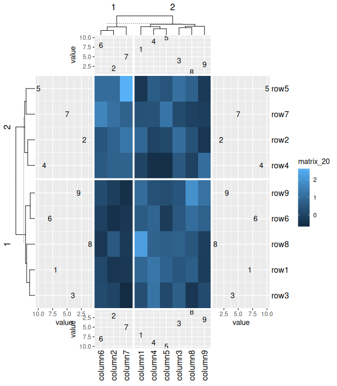
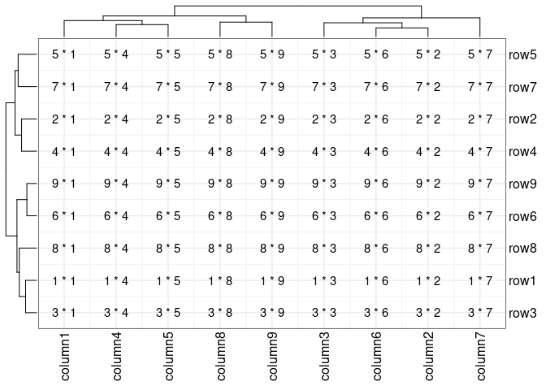
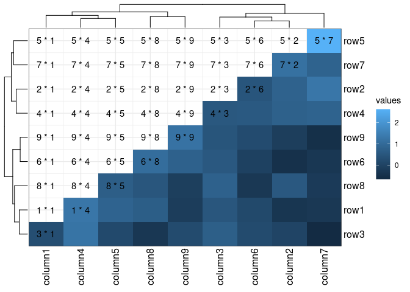
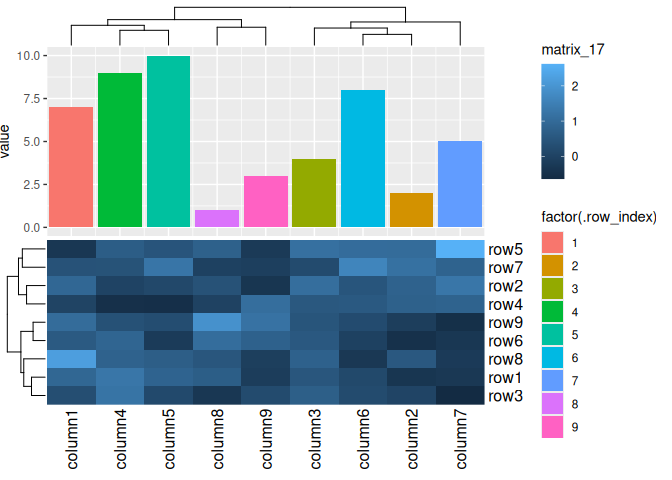

<!-- README.md is generated from README.Rmd. Please edit that file -->

# eheat

<!-- badges: start -->

<!-- badges: end -->

This package serves as a bridge between the ggplot2 and ComplexHeatmap
packages. Essentially, all ggplot2 geometries and operations can be
utilized in ComplexHeatmap through the `eheat` package, with the
exception of facet operations (and you shouldn’t do it in `eheat`
package). Fortunately, ComplexHeatmap is capable of handling these
operations independently, rendering them unnecessary.

## Installation

You can install the development version of `eheat` from
[GitHub](https://github.com/) with:

``` r
if (!requireNamespace("pak")) {
  install.packages("pak",
    repos = sprintf(
      "https://r-lib.github.io/p/pak/devel/%s/%s/%s",
      .Platform$pkgType, R.Version()$os, R.Version()$arch
    )
  )
}
pak::pkg_install("Yunuuuu/eheat")
```

``` r
library(eheat)
library(ggplot2)
library(ComplexHeatmap)
#> Loading required package: grid
#> ========================================
#> ComplexHeatmap version 2.15.4
#> Bioconductor page: http://bioconductor.org/packages/ComplexHeatmap/
#> Github page: https://github.com/jokergoo/ComplexHeatmap
#> Documentation: http://jokergoo.github.io/ComplexHeatmap-reference
#> 
#> If you use it in published research, please cite either one:
#> - Gu, Z. Complex Heatmap Visualization. iMeta 2022.
#> - Gu, Z. Complex heatmaps reveal patterns and correlations in multidimensional 
#>     genomic data. Bioinformatics 2016.
#> 
#> 
#> The new InteractiveComplexHeatmap package can directly export static 
#> complex heatmaps into an interactive Shiny app with zero effort. Have a try!
#> 
#> This message can be suppressed by:
#>   suppressPackageStartupMessages(library(ComplexHeatmap))
#> ========================================
```

Let’s begin by creating some example data, following code was copied
from ComplexHeatmap book directly

``` r
set.seed(123)
nr1 <- 4
nr2 <- 8
nr3 <- 6
nr <- nr1 + nr2 + nr3
nc1 <- 6
nc2 <- 8
nc3 <- 10
nc <- nc1 + nc2 + nc3
mat <- cbind(
  rbind(
    matrix(rnorm(nr1 * nc1, mean = 1, sd = 0.5), nrow = nr1),
    matrix(rnorm(nr2 * nc1, mean = 0, sd = 0.5), nrow = nr2),
    matrix(rnorm(nr3 * nc1, mean = 0, sd = 0.5), nrow = nr3)
  ),
  rbind(
    matrix(rnorm(nr1 * nc2, mean = 0, sd = 0.5), nrow = nr1),
    matrix(rnorm(nr2 * nc2, mean = 1, sd = 0.5), nrow = nr2),
    matrix(rnorm(nr3 * nc2, mean = 0, sd = 0.5), nrow = nr3)
  ),
  rbind(
    matrix(rnorm(nr1 * nc3, mean = 0.5, sd = 0.5), nrow = nr1),
    matrix(rnorm(nr2 * nc3, mean = 0.5, sd = 0.5), nrow = nr2),
    matrix(rnorm(nr3 * nc3, mean = 1, sd = 0.5), nrow = nr3)
  )
)
mat <- mat[sample(nr, nr), sample(nc, nc)] # random shuffle rows and columns
rownames(mat) <- paste0("row", seq_len(nr))
colnames(mat) <- paste0("column", seq_len(nc))
small_mat <- mat[1:9, 1:9]
```

The central functions of the `eheat` package are `ggheat` and `gganno`.
These two functions encompass all the necessary functionalities.
`ggheat` serves as a substitute for the `ComplexHeatmap::Heatmap`
function, while `gganno` replaces all the `anno_*` functions within the
ComplexHeatmap package, offering a comprehensive solution for our
requirements. One of the key advantages of using ggplot2 in
ComplexHeatmap is the ease of plotting statistical annotations. Another
benefit is that the legends can be internally extracted from the ggplot2
plot, eliminating the need for manual addition of legends.

## ggheat

Using `ggheat`, it is effortless to create a simple Heatmap. The default
color mapping was not consistent between ComplexHeatmap and ggplot2.

``` r
draw(ggheat(small_mat))
```


You do not need to explicitly specify the color mapping as you can
utilize the `scale_*` function directly from ggplot2. All guide legends
will directly extracted from `ggplot2`. The essential parameter of
`ggheat` is `ggfn`, which accepts a ggplot2 object equipped with a
default data and mappings established via `ggplot(data,
aes(.data$.column, .data$.row))`. By default, the data includes 7
columns, each prefixed with a dot for caution.

  - `.slice`: slice number, combine `.slice_row` and `.slice_column`.

  - `.slice_row`: the slice row number.

  - `.slice_column`: the slice column number.

  - `.row` and `.column`: the row and column coordinates.

  - `.row_index` and `.column_index`: the row and column index of the
    original

<!-- end list -->

``` r
pdf(NULL)
draw(ggheat(small_mat, function(x) {
  print(head(x$data))
  x
}))
#>   .row_index .column_index .slice_row .slice_column .row .column .slice
#> 1          1             1          1             1    2       1   r1c1
#> 2          1             2          1             1    2       8   r1c1
#> 3          1             3          1             1    2       6   r1c1
#> 4          1             4          1             1    2       2   r1c1
#> 5          1             5          1             1    2       3   r1c1
#> 6          1             6          1             1    2       7   r1c1
#>       values
#> 1  0.9047416
#> 2 -0.3522982
#> 3  0.5016096
#> 4  1.2676994
#> 5  0.8251229
#> 6  0.1621522
dev.off()
#> png 
#>   2
```

The richness of the `scale_*` function in ggplot2 makes it easy to
modify the color mapping according to our needs.

``` r
draw(ggheat(small_mat, function(p) {
  # will use zero as midpoint
  p + scale_fill_gradient2()
}))
```


``` r
draw(ggheat(small_mat, function(p) {
  p + scale_fill_viridis_c(option = "magma")
}))
```


Legends can be controlled by `guide_*` function in ggplot2.

``` r
draw(ggheat(small_mat, function(p) {
  p + scale_fill_viridis_c(guide = guide_colorbar(direction = "horizontal"))
}))
```



You can add more geoms.

``` r
draw(
  ggheat(small_mat, function(p) {
    p +
      geom_text(aes(label = sprintf("%d * %d", .row_index, .column_index)))
  })
)
```


You can also use the same way in ComplexHeatmap to prevent the internal
rect filling by setting `rect_gp = gpar(type = "none")`. The clustering
is still applied but nothing in drawn on the heatmap body.

``` r
draw(
  ggheat(small_mat, rect_gp = gpar(type = "none"))
)
```


Note that the background is different between ggplot2 and
ComplexHeatmap. However, the theme system in ggplot2 makes it easy to
modify and customize the background according to our preferences.

``` r
draw(
  ggheat(small_mat, function(p) {
    p +
      geom_text(aes(label = sprintf("%d * %d", .row_index, .column_index))) +
      theme_bw()
  }, rect_gp = gpar(type = "none"))
)
```



You can customize it easily use `geom_tile`.

``` r
draw(
  ggheat(small_mat, function(p) {
    p +
      geom_tile(
        aes(fill = values),
        width = 1L, height = 1L,
        data = ~ dplyr::filter(p$data, .row <= .column)
      ) +
      geom_text(
        aes(label = sprintf("%d * %d", .row_index, .column_index)),
        data = ~ dplyr::filter(p$data, .row >= .column)
      ) +
      theme_bw()
  }, rect_gp = gpar(type = "none"))
)
```



All the functionalities of the `ComplexHeatmap::Heatmap` function can be
used as is.

``` r
draw(ggheat(small_mat, function(p) {
  p + scale_fill_viridis_c()
}, column_km = 2L))
```


``` r
draw(ggheat(small_mat, function(p) {
  p + scale_fill_viridis_c()
}, column_km = 2L, row_km = 3))
```


We can combine `layer_fun` or `cell_fun` from ComplexHeatmap with `ggfn`

``` r
draw(
  ggheat(small_mat,
    layer_fun = function(...) {
      grid.rect(gp = gpar(lwd = 2, fill = "transparent", col = "red"))
    }, column_km = 2L, row_km = 3
  )
)
```


The row names and column names should be controlled by the
`ComplexHeatmap::Heatmap` function, while the legends should be
controlled by `ggplot2`. However, the default legend name is taken from
`ComplexHeatmap::Heatmap` in order to maintain consistency.
Nevertheless, you can directly override it in `ggfn`.

``` r
draw(ggheat(small_mat, function(p) {
  p + scale_fill_viridis_c()
}, column_km = 2L, row_km = 3, row_names_gp = gpar(col = "red")))
```


``` r
draw(
  ggheat(small_mat, function(p) {
    p + scale_fill_viridis_c()
  },
  column_km = 2L, row_km = 3, row_names_gp = gpar(col = "red"),
  name = "ComplexHeatmap"
  )
)
```


``` r
draw(
  ggheat(small_mat, function(p) {
    p + scale_fill_viridis_c(name = "ggplot2")
  },
  column_km = 2L, row_km = 3, row_names_gp = gpar(col = "red"),
  name = "ComplexHeatmap"
  )
)
```


## gganno

Both `gganno` and `gganno2` perform identical functions, but `gganno` is
not compatible with direct integration with `ComplexHeatmap::Heatmap`.
In such cases, only an empty annotation region can be added. On the
other hand, `gganno2` can be seamlessly combined with both
`ComplexHeatmap::Heatmap` and `ggheat`, although legends will not be
extracted.

The same with `ggheat`, the essential parameter of `gganno` is also
`ggfn`, which accepts a ggplot2 object equipped with a default data and
mappings established by `ggplot(data, aes(.data$.x (or .data$.y)))`. The
original matrix will be converted into a data.frame with another 3
columns added:

  - `.slice`: the slice row (which = “row”) or column (which = “column”)
    number.

  - `.x`/`.y`: indicating the x-axis (or y-axis) coordinates. Don’t use
    `ggplot2::coord_flip` to flip coordinates as it may disrupt internal
    operations.

  - `.index`: denoting the row index of the original matrix, where rows
    are uniformly considered as observations and columns as variables.

In general, we should just use `ggheat` and `gganno`.

``` r
anno_data <- sample(1:10, nrow(small_mat))
draw(ggheat(small_mat,
  top_annotation = HeatmapAnnotation(
    foo = gganno(
      # Note: vector will be converted one-column data.frame
      # with a column names `V1`
      matrix = anno_data,
      function(p) {
        p + geom_point(aes(.x, V1))
      }
    ), which = "column"
  )
))
#> ℹ convert simple vector `matrix` to one-column matrix
```


Legends will also be extracted, in the similar manner like passing them
into `annotation_legend_list`.

``` r
draw(ggheat(small_mat,
  top_annotation = HeatmapAnnotation(
    foo = gganno(
      matrix = anno_data,
      function(p) {
        p + geom_bar(aes(y = V1, fill = factor(.index)), stat = "identity")
      }, height = unit(5, "cm")
    ), which = "column"
  )
), merge_legends = TRUE)
#> ℹ convert simple vector `matrix` to one-column matrix
```



``` r
draw(ggheat(small_mat,
  top_annotation = HeatmapAnnotation(
    foo = gganno(
      matrix = anno_data,
      function(p) {
        p + geom_boxplot(aes(y = V1, fill = factor(.slice)))
      }, height = unit(5, "cm")
    ), which = "column"
  ), column_km = 2L
), merge_legends = TRUE)
#> ℹ convert simple vector `matrix` to one-column matrix
```


``` r
box_matrix1 <- matrix(rnorm(ncol(small_mat)^2L, 10), nrow = ncol(small_mat))
colnames(box_matrix1) <- rep_len("group1", ncol(small_mat))
box_matrix2 <- matrix(rnorm(ncol(small_mat)^2L, 20), nrow = ncol(small_mat))
colnames(box_matrix2) <- rep_len("group2", ncol(small_mat))
draw(ggheat(small_mat,
  top_annotation = HeatmapAnnotation(
    foo = gganno(
      matrix = cbind(box_matrix1, box_matrix2),
      function(p) {
        long_data <- ~ tidyr::pivot_longer(.x, starts_with("group"),
          names_to = "group"
        )
        p +
          geom_violin(
            aes(
              y = value, fill = factor(group),
              color = factor(.slice),
              group = paste(.slice, .index, group, sep = "-")
            ),
            data = long_data
          ) +
          geom_boxplot(
            aes(
              y = value, fill = factor(group),
              color = factor(.slice),
              group = paste(.slice, .index, group, sep = "-")
            ),
            width = 0.2,
            position = position_dodge(width = 0.9),
            data = long_data
          ) +
          scale_fill_brewer(
            name = "Group", type = "qual", palette = "Set3"
          ) +
          scale_color_brewer(
            name = "Slice", type = "qual", palette = "Set1"
          )
      }, height = unit(3, "cm")
    ), which = "column"
  ), column_km = 2L
), merge_legends = TRUE)
```


``` r
draw(ggheat(small_mat,
  top_annotation = HeatmapAnnotation(
    foo = gganno(
      matrix = anno_data,
      function(p) {
        p + aes(y = V1) + geom_text(aes(label = .index))
      }, height = unit(2, "cm")
    ), which = "column"
  ),
  bottom_annotation = HeatmapAnnotation(
    foo = gganno(
      function(p) {
        p + aes(y = V1) +
          geom_text(aes(label = .index)) +
          scale_y_continuous(limits = rev)
      },
      matrix = anno_data,
      which = "column", height = unit(2, "cm")
    ),
    which = "column"
  ),
  right_annotation = HeatmapAnnotation(
    foo = gganno(
      function(p) {
        p + aes(x = V1) +
          geom_text(aes(label = .index))
      },
      matrix = anno_data,
      width = unit(3, "cm")
    ),
    which = "row"
  ),
  left_annotation = HeatmapAnnotation(
    foo = gganno(
      function(p) {
        p + aes(x = V1) +
          geom_text(aes(label = .index)) +
          scale_x_continuous(limits = rev)
      },
      matrix = anno_data,
      width = unit(3, "cm")
    ),
    which = "row"
  ),
  row_km = 2L, column_km = 2L,
), merge_legends = TRUE)
#> ℹ convert simple vector `matrix` to one-column matrix
#> ℹ convert simple vector `matrix` to one-column matrix
#> ℹ convert simple vector `matrix` to one-column matrix
#> ℹ convert simple vector `matrix` to one-column matrix
#> Warning: Attempting to add facetted x scales, while x scales are not free.
#> ℹ Try adding `scales = "free_x"` to the facet.
#> Warning: Attempting to add facetted y scales, while y scales are not free.
#> ℹ Try adding `scales = "free_y"` to the facet.
```


Finally, let’s see the difference between `gganno2` and `gganno`.

`gganno2` will not extract the legend.

``` r
draw(ggheat(small_mat,
  top_annotation = HeatmapAnnotation(
    foo = gganno2(
      matrix = anno_data,
      function(p) {
        p + geom_bar(aes(y = V1, fill = factor(.index)), stat = "identity")
      }
    ), which = "column"
  )
), merge_legends = TRUE)
#> ℹ convert simple vector `matrix` to one-column matrix
```


But `gganno2` can work with `Heatmap` function.

``` r
anno_data <- sample(1:10, nrow(small_mat))
draw(Heatmap(small_mat,
  top_annotation = HeatmapAnnotation(
    foo = gganno2(
      matrix = anno_data,
      function(p) {
        p + geom_point(aes(.x, V1))
      }
    ), which = "column"
  )
), merge_legends = TRUE)
#> ℹ convert simple vector `matrix` to one-column matrix
```


`gganno` will just add a blank region in `Heatmap` function.

``` r
draw(Heatmap(small_mat,
  top_annotation = HeatmapAnnotation(
    foo = gganno(
      matrix = anno_data,
      function(p) {
        p + geom_bar(aes(y = V1, fill = factor(.index)), stat = "identity")
      }
    ), which = "column"
  )
), merge_legends = TRUE)
#> ℹ convert simple vector `matrix` to one-column matrix
```


