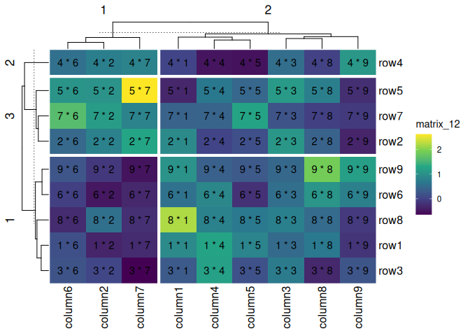
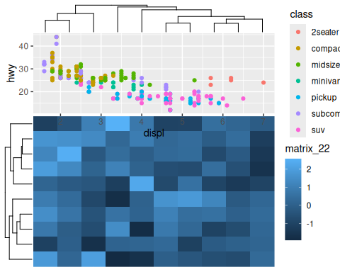
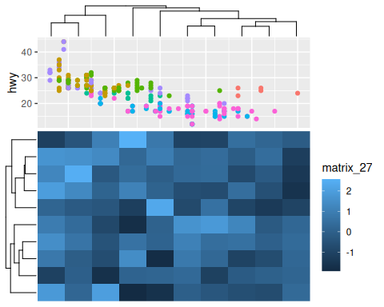

- [eheat](#eheat)
  - [Installation](#installation)
  - [`ggheat`](#ggheat)
  - [`gganno`](#gganno)
  - [`anno_gg` and `anno_gg2`](#anno_gg-and-anno_gg2)
  - [sessionInfo](#sessioninfo)

<!-- README.md is generated from README.Rmd. Please edit that file -->

# eheat

<!-- badges: start -->

[](https://github.com/Yunuuuu/eheat/actions/workflows/R-CMD-check.yaml)
<!-- badges: end -->

This package serves as a bridge between the
[ggplot2](https://ggplot2.tidyverse.org/) and
[ComplexHeatmap](https://github.com/jokergoo/ComplexHeatmap) packages.
Essentially, all ggplot2 geometries and operations can be utilized in
ComplexHeatmap through the `eheat` package, with the exception of facet
operations (and you shouldn’t do it in `eheat` package). Fortunately,
ComplexHeatmap is capable of handling these operations independently,
rendering them unnecessary.

## Installation

You can install the development version of `eheat` from
[GitHub](https://github.com/) with:

``` r
if (!requireNamespace("pak")) {
  install.packages("pak",
    repos = sprintf(
      "https://r-lib.github.io/p/pak/devel/%s/%s/%s",
      .Platform$pkgType, R.Version()$os, R.Version()$arch
    )
  )
}
pak::pkg_install("Yunuuuu/eheat")
```

``` r
library(eheat)
#> Loading required package: ComplexHeatmap
#> Loading required package: grid
#> ========================================
#> ComplexHeatmap version 2.20.0
#> Bioconductor page: http://bioconductor.org/packages/ComplexHeatmap/
#> Github page: https://github.com/jokergoo/ComplexHeatmap
#> Documentation: http://jokergoo.github.io/ComplexHeatmap-reference
#> 
#> If you use it in published research, please cite either one:
#> - Gu, Z. Complex Heatmap Visualization. iMeta 2022.
#> - Gu, Z. Complex heatmaps reveal patterns and correlations in multidimensional 
#>     genomic data. Bioinformatics 2016.
#> 
#> 
#> The new InteractiveComplexHeatmap package can directly export static 
#> complex heatmaps into an interactive Shiny app with zero effort. Have a try!
#> 
#> This message can be suppressed by:
#>   suppressPackageStartupMessages(library(ComplexHeatmap))
#> ========================================
#> Loading required package: ggplot2
```

Let’s begin by creating some example data, following code was copied
from ComplexHeatmap book directly

``` r
set.seed(123)
nr1 <- 4
nr2 <- 8
nr3 <- 6
nr <- nr1 + nr2 + nr3
nc1 <- 6
nc2 <- 8
nc3 <- 10
nc <- nc1 + nc2 + nc3
mat <- cbind(
  rbind(
    matrix(rnorm(nr1 * nc1, mean = 1, sd = 0.5), nrow = nr1),
    matrix(rnorm(nr2 * nc1, mean = 0, sd = 0.5), nrow = nr2),
    matrix(rnorm(nr3 * nc1, mean = 0, sd = 0.5), nrow = nr3)
  ),
  rbind(
    matrix(rnorm(nr1 * nc2, mean = 0, sd = 0.5), nrow = nr1),
    matrix(rnorm(nr2 * nc2, mean = 1, sd = 0.5), nrow = nr2),
    matrix(rnorm(nr3 * nc2, mean = 0, sd = 0.5), nrow = nr3)
  ),
  rbind(
    matrix(rnorm(nr1 * nc3, mean = 0.5, sd = 0.5), nrow = nr1),
    matrix(rnorm(nr2 * nc3, mean = 0.5, sd = 0.5), nrow = nr2),
    matrix(rnorm(nr3 * nc3, mean = 1, sd = 0.5), nrow = nr3)
  )
)
mat <- mat[sample(nr, nr), sample(nc, nc)] # random shuffle rows and columns
rownames(mat) <- paste0("row", seq_len(nr))
colnames(mat) <- paste0("column", seq_len(nc))
small_mat <- mat[1:9, 1:9]
```

The central functions of the `eheat` package are `ggheat` and `gganno`.
These two functions encompass all the necessary functionalities.
`ggheat` serves as a substitute for the `ComplexHeatmap::Heatmap`
function, while `gganno` replaces all the `anno_*` functions within the
ComplexHeatmap package, offering a comprehensive solution for our
requirements. One of the key advantages of using ggplot2 in
ComplexHeatmap is the ease of plotting statistical annotations. Another
benefit is that the legends can be internally extracted from the ggplot2
plot, eliminating the need for manual addition of legends.

## `ggheat`

Using `ggheat`, it is effortless to create a simple Heatmap. The default
color mapping was not consistent between ComplexHeatmap and ggplot2.

``` r
draw(ggheat(small_mat))
```


You do not need to explicitly specify the color mapping as you can
utilize the `scale_*` function directly from ggplot2. All guide legends
will directly extracted from `ggplot2`. The essential parameter of
`ggheat` is `ggfn`, which accepts a ggplot2 object with a default data
and mapping created by `ggplot(data, aes(.data$x, .data$y))`. the data
contains following columns:

- `.slice`: slice number, combine `.slice_row` and `.slice_column`.

- `.slice_row`: the slice row number

- `.slice_column`: the slice column number

- `.row_names` and `.column_names`: the row and column names of the
  original matrix (only applicable when names exist).

- `.row_index` and `.column_index`: the row and column index of the
  original matrix.

- `x` and `y`: the `x` and `y` coordinates

- `value`: the actual matrix value for the heatmap matrix.

``` r
pdf(NULL)
draw(ggheat(small_mat, function(x) {
  print(head(x$data))
  x
}))
#>   .slice .slice_row .slice_column .row_names .column_names .row_index
#> 1   r1c1          1             1       row1       column1          1
#> 2   r1c1          1             1       row1       column2          1
#> 3   r1c1          1             1       row1       column3          1
#> 4   r1c1          1             1       row1       column4          1
#> 5   r1c1          1             1       row1       column5          1
#> 6   r1c1          1             1       row1       column6          1
#>   .column_index x y      value
#> 1             1 1 2  0.9047416
#> 2             2 8 2 -0.3522982
#> 3             3 6 2  0.5016096
#> 4             4 2 2  1.2676994
#> 5             5 3 2  0.8251229
#> 6             6 7 2  0.1621522
```

``` r
dev.off()
#> png 
#>   2
```

The richness of the `scale_*` function in ggplot2 makes it easy to
modify the color mapping.

``` r
draw(ggheat(small_mat, function(p) {
  # will use zero as midpoint
  p + scale_fill_gradient2()
}))
```


``` r
draw(ggheat(small_mat, function(p) {
  p + scale_fill_viridis_c(option = "magma")
}))
```


Legends can be controlled by `guide_*` function in ggplot2.

``` r
draw(ggheat(small_mat, function(p) {
  p + scale_fill_viridis_c(guide = guide_colorbar(direction = "horizontal"))
}))
```


You can add more geoms.

``` r
draw(
  ggheat(small_mat, function(p) {
    p +
      geom_text(aes(label = sprintf("%d * %d", .row_index, .column_index)))
  })
)
```


You can also use the same way in ComplexHeatmap to prevent the internal
rect filling by setting `rect_gp = gpar(type = "none")`. The clustering
is still applied but nothing in drawn on the heatmap body.

``` r
draw(ggheat(small_mat, rect_gp = gpar(type = "none")))
```


Note that the background is different between ggplot2 and
ComplexHeatmap. However, the theme system in ggplot2 makes it easy to
modify and customize the background.

``` r
draw(
  ggheat(small_mat, function(p) {
    p +
      geom_text(aes(label = sprintf("%d * %d", .row_index, .column_index))) +
      theme_bw()
  }, rect_gp = gpar(type = "none"))
)
```


You can customize it easily use `geom_tile`.

``` r
draw(
  ggheat(small_mat, function(p) {
    p +
      geom_tile(
        aes(fill = value),
        width = 1L, height = 1L,
        data = ~ dplyr::filter(p$data, y <= x)
      ) +
      geom_text(
        aes(label = sprintf("%d * %d", .row_index, .column_index)),
        data = ~ dplyr::filter(p$data, y >= x)
      ) +
      theme_bw()
  }, rect_gp = gpar(type = "none"))
)
```


All the functionalities of the `ComplexHeatmap::Heatmap` function can be
used as is.

``` r
draw(ggheat(small_mat, function(p) {
  p + scale_fill_viridis_c()
}, column_km = 2L))
```


``` r
draw(ggheat(small_mat, function(p) {
  p + scale_fill_viridis_c()
}, column_km = 2L, row_km = 3))
```


``` r
draw(ggheat(small_mat, function(p) {
  p +
    geom_text(aes(label = sprintf("%d * %d", .row_index, .column_index))) +
    scale_fill_viridis_c()
}, column_km = 2L, row_km = 3))
```



We can combine `layer_fun` or `cell_fun` from ComplexHeatmap with `ggfn`

``` r
draw(
  ggheat(small_mat,
    layer_fun = function(...) {
      grid.rect(gp = gpar(lwd = 2, fill = "transparent", col = "red"))
    }, column_km = 2L, row_km = 3
  )
)
```


`ggheat` only takes over the heatmap body and legends.The row names and
column names are controlled by the `ComplexHeatmap::Heatmap` function.

``` r
draw(ggheat(small_mat, function(p) {
  p + scale_fill_viridis_c()
}, column_km = 2L, row_km = 3, row_names_gp = gpar(col = "red")))
```


While the legends are controlled by `ggplot2`, the default legend name
is taken from `ComplexHeatmap::Heatmap` in order to maintain
consistency.

``` r
draw(
  ggheat(small_mat, function(p) {
    p + scale_fill_viridis_c()
  },
  column_km = 2L, row_km = 3, row_names_gp = gpar(col = "red"),
  name = "ComplexHeatmap"
  )
)
```


Nevertheless, you can directly override it in `ggfn`.

``` r
draw(
  ggheat(small_mat, function(p) {
    p + scale_fill_viridis_c(name = "ggplot2")
  },
  column_km = 2L, row_km = 3, row_names_gp = gpar(col = "red"),
  name = "ComplexHeatmap"
  )
)
```


Inside guides will be kept in the panel.

``` r
draw(
  ggheat(small_mat, function(p) {
    p +
      geom_tile(
        aes(fill = value),
        width = 1L, height = 1L,
        data = ~ dplyr::filter(.x, y <= x)
      ) +
      theme_bw() +
      theme(
        legend.position = "inside",
        legend.position.inside = c(0.2, 0.3)
      )
  }, rect_gp = gpar(type = "none"), column_km = 2L, row_km = 3)
)
```


## `gganno`

The same with `ggheat`, the essential parameter of `gganno` is also the
`ggfn`, which accepts a ggplot2 object with a default data and mapping
created by `ggplot(data, aes(.data$x))` /
`ggplot(data, ggplot2::aes(y = .data$y))`. The original matrix will be
converted into a long-data.frame (`gganno` always regard row as the
observations) with following columns.

- `.slice`: the slice row (which = “row”) or column (which = “column”)
  number.
- `.row_names` and `.column_names`: the row and column names of the
  original matrix (only applicable when names exist).
- `.row_index` and `.column_index`: the row and column index of the
  original matrix.
- `x` / `y`: indicating the x-axis (or y-axis) coordinates. Don’t use
  \[coord_flip\]\[ggplot2::coord_flip\] to flip coordinates as it may
  disrupt internal operations.
- `value`: the actual matrix value of the annotation matrix.

`gganno` can be seamlessly combined with both `ggheat` and
`ComplexHeatmap::Heatmap`, although legends will not be extracted in the
later case.

In general, we should just use `ggheat` and `gganno`.

``` r
anno_data <- sample(1:10, nrow(small_mat))
draw(ggheat(small_mat,
  top_annotation = HeatmapAnnotation(
    foo = gganno(
      matrix = anno_data,
      function(p) {
        p + geom_point(aes(x, value))
      }
    ), which = "column"
  )
))
#> ℹ convert simple vector to one-column matrix
```


Legends will also be extracted, in the similar manner like passing them
into `annotation_legend_list`.

``` r
draw(ggheat(small_mat,
  top_annotation = HeatmapAnnotation(
    foo = gganno(
      matrix = anno_data,
      function(p) {
        p + geom_bar(aes(y = value, fill = factor(.row_index)), stat = "identity")
      }, height = unit(5, "cm")
    ), which = "column"
  )
), merge_legends = TRUE)
#> ℹ convert simple vector to one-column matrix
```


``` r
draw(ggheat(small_mat,
  top_annotation = HeatmapAnnotation(
    foo = gganno(
      matrix = anno_data,
      function(p) {
        p + geom_boxplot(aes(y = value, fill = factor(.slice)))
      }, height = unit(5, "cm")
    ), which = "column"
  ), column_km = 2L
), merge_legends = TRUE)
#> ℹ convert simple vector to one-column matrix
```


``` r
box_matrix1 <- matrix(rnorm(ncol(small_mat)^2L, 10), nrow = ncol(small_mat))
colnames(box_matrix1) <- rep_len("group1", ncol(small_mat))
box_matrix2 <- matrix(rnorm(ncol(small_mat)^2L, 20), nrow = ncol(small_mat))
colnames(box_matrix2) <- rep_len("group2", ncol(small_mat))
draw(ggheat(small_mat,
  top_annotation = HeatmapAnnotation(
    foo = gganno(
      matrix = cbind(box_matrix1, box_matrix2),
      function(p) {
        p +
          geom_violin(
            aes(
              y = value, fill = factor(.column_names),
              color = factor(.slice),
              group = paste(.slice, .row_index, .column_names, sep = "-")
            )
          ) +
          geom_boxplot(
            aes(
              y = value, fill = factor(.column_names),
              color = factor(.slice),
              group = paste(.slice, .row_index, .column_names, sep = "-")
            ),
            width = 0.2,
            position = position_dodge(width = 0.9)
          ) +
          scale_fill_brewer(
            name = "Group", type = "qual", palette = "Set3"
          ) +
          scale_color_brewer(
            name = "Slice", type = "qual", palette = "Set1"
          )
      }, height = unit(3, "cm")
    ), which = "column"
  ), column_km = 2L
), merge_legends = TRUE)
```


``` r
draw(ggheat(small_mat,
  top_annotation = HeatmapAnnotation(
    foo = gganno(
      matrix = anno_data,
      function(p) {
        p + aes(y = value) + geom_text(aes(label = .row_index))
      }, height = unit(2, "cm")
    ), which = "column"
  ),
  bottom_annotation = HeatmapAnnotation(
    foo = gganno(
      function(p) {
        p + aes(y = value) +
          geom_text(aes(label = .row_index)) +
          scale_y_reverse()
      },
      matrix = anno_data,
      which = "column", height = unit(2, "cm")
    ),
    which = "column"
  ),
  right_annotation = HeatmapAnnotation(
    foo = gganno(
      function(p) {
        p + aes(x = value) +
          geom_text(aes(label = .row_index))
      },
      matrix = anno_data,
      width = unit(3, "cm")
    ),
    which = "row"
  ),
  left_annotation = HeatmapAnnotation(
    foo = gganno(
      function(p) {
        p + aes(x = value) +
          geom_text(aes(label = .row_index)) +
          scale_x_reverse()
      },
      matrix = anno_data,
      width = unit(3, "cm")
    ),
    which = "row"
  ),
  row_km = 2L, column_km = 2L,
), merge_legends = TRUE)
#> ℹ convert simple vector to one-column matrix
#> ℹ convert simple vector to one-column matrix
#> ℹ convert simple vector to one-column matrix
#> ℹ convert simple vector to one-column matrix
```


`gganno` can work with `Heatmap` function, but cannot extract the
legend.

``` r
draw(Heatmap(small_mat,
  top_annotation = HeatmapAnnotation(
    foo = gganno(
      matrix = anno_data,
      function(p) {
        p + geom_bar(aes(y = value, fill = factor(.row_index)), stat = "identity")
      }
    ), which = "column"
  )
), merge_legends = TRUE)
#> ℹ convert simple vector to one-column matrix
```


## `anno_gg` and `anno_gg2`

Both function acts similar with other annotation function in
ComplexHeatmap. They accept a ggplot object and fit it in the
ComplexHeatmap annotation area.

``` r
g <- ggplot(mpg, aes(displ, hwy, colour = class)) +
  geom_point()
m <- matrix(rnorm(100), 10)

# anno_gg-panel: clip = "off" -------
ggheat(m,
  top_annotation = HeatmapAnnotation(
    ggplot = anno_gg(g, "panel",
      clip = "off",
      height = unit(3, "cm"),
      show_name = FALSE
    )
  )
)
```



``` r
# anno_gg-panel: clip = "on" --------
ggheat(m,
  top_annotation = HeatmapAnnotation(
    ggplot = anno_gg(g, "panel",
      clip = "on",
      height = unit(3, "cm"),
      show_name = FALSE
    )
  )
)
```


``` r
# anno_gg-plot --------------------
ggheat(m,
  top_annotation = HeatmapAnnotation(
    ggplot = anno_gg(g, "plot",
      height = unit(3, "cm"),
      show_name = FALSE
    )
  )
)
```


``` r

# anno_gg-full --------------------
ggheat(m,
  top_annotation = HeatmapAnnotation(
    ggplot = anno_gg(g, "full",
      height = unit(3, "cm"),
      show_name = FALSE
    )
  )
)
```


`anno_gg2` is the same with `anno_gg`, it differs in terms of its
arguments, and allow more precise adjustment of the clip feature.

``` r
# anno_gg2-panel: margins = NULL -------
ggheat(m,
  top_annotation = HeatmapAnnotation(
    ggplot = anno_gg2(g, "panel",
      margins = NULL,
      height = unit(3, "cm"),
      show_name = FALSE
    )
  )
)
```


``` r
# anno_gg2-panel: margins = "l" --------
ggheat(m,
  top_annotation = HeatmapAnnotation(
    ggplot = anno_gg2(g, "panel",
      margins = "l",
      height = unit(3, "cm"),
      show_name = FALSE
    )
  )
)
```



``` r
# anno_gg2-panel: margins = "r" --------
ggheat(m,
  top_annotation = HeatmapAnnotation(
    ggplot = anno_gg2(g, "panel",
      margins = "r",
      height = unit(3, "cm"),
      show_name = FALSE
    )
  )
)
```


``` r
# anno_gg2-plot ---------------------
ggheat(m,
  top_annotation = HeatmapAnnotation(
    ggplot = anno_gg2(g, "plot",
      height = unit(3, "cm"),
      show_name = FALSE
    )
  )
)
```


``` r
# anno_gg2-full --------------------
ggheat(m,
  top_annotation = HeatmapAnnotation(
    ggplot = anno_gg2(
      g + guides(colour = guide_legend(
        theme = theme(
          legend.key.size = unit(1, "mm"),
          legend.text = element_text(size = 10),
          legend.key.spacing = unit(0, "mm"),
          legend.title.position = "bottom",
          legend.key = element_blank()
        ),
        ncol = 2L
      )),
      align_with = "full",
      height = unit(3, "cm"),
      show_name = FALSE
    )
  )
)
```


## sessionInfo

``` r
sessionInfo()
#> R version 4.4.0 (2024-04-24)
#> Platform: x86_64-pc-linux-gnu
#> Running under: Ubuntu 24.04 LTS
#> 
#> Matrix products: default
#> BLAS/LAPACK: /usr/lib/x86_64-linux-gnu/libmkl_rt.so;  LAPACK version 3.8.0
#> 
#> locale:
#>  [1] LC_CTYPE=C.UTF-8       LC_NUMERIC=C           LC_TIME=C.UTF-8       
#>  [4] LC_COLLATE=C.UTF-8     LC_MONETARY=C.UTF-8    LC_MESSAGES=C.UTF-8   
#>  [7] LC_PAPER=C.UTF-8       LC_NAME=C              LC_ADDRESS=C          
#> [10] LC_TELEPHONE=C         LC_MEASUREMENT=C.UTF-8 LC_IDENTIFICATION=C   
#> 
#> time zone: Asia/Shanghai
#> tzcode source: system (glibc)
#> 
#> attached base packages:
#> [1] grid      stats     graphics  grDevices utils     datasets  methods  
#> [8] base     
#> 
#> other attached packages:
#> [1] eheat_0.99.6          ggplot2_3.5.1         ComplexHeatmap_2.20.0
#> 
#> loaded via a namespace (and not attached):
#>  [1] utf8_1.2.4          generics_0.1.3      tidyr_1.3.1        
#>  [4] shape_1.4.6.1       digest_0.6.35       magrittr_2.0.3     
#>  [7] evaluate_0.24.0     RColorBrewer_1.1-3  iterators_1.0.14   
#> [10] circlize_0.4.16     fastmap_1.2.0       foreach_1.5.2      
#> [13] doParallel_1.0.17   GlobalOptions_0.1.2 purrr_1.0.2        
#> [16] fansi_1.0.6         viridisLite_0.4.2   scales_1.3.0       
#> [19] codetools_0.2-20    cli_3.6.2           rlang_1.1.4        
#> [22] crayon_1.5.2        munsell_0.5.1       withr_3.0.0        
#> [25] yaml_2.3.8          ggh4x_0.2.8         tools_4.4.0        
#> [28] parallel_4.4.0      dplyr_1.1.4         colorspace_2.1-0   
#> [31] GetoptLong_1.0.5    BiocGenerics_0.50.0 vctrs_0.6.5        
#> [34] R6_2.5.1            png_0.1-8           matrixStats_1.3.0  
#> [37] stats4_4.4.0        lifecycle_1.0.4     magick_2.8.3       
#> [40] S4Vectors_0.42.0    IRanges_2.38.0      clue_0.3-65        
#> [43] cluster_2.1.6       pkgconfig_2.0.3     pillar_1.9.0       
#> [46] gtable_0.3.5        glue_1.7.0          Rcpp_1.0.12        
#> [49] highr_0.11          xfun_0.45           tibble_3.2.1       
#> [52] tidyselect_1.2.1    knitr_1.47          farver_2.1.2       
#> [55] rjson_0.2.21        htmltools_0.5.8.1   labeling_0.4.3     
#> [58] rmarkdown_2.27      Cairo_1.6-2         compiler_4.4.0
```
